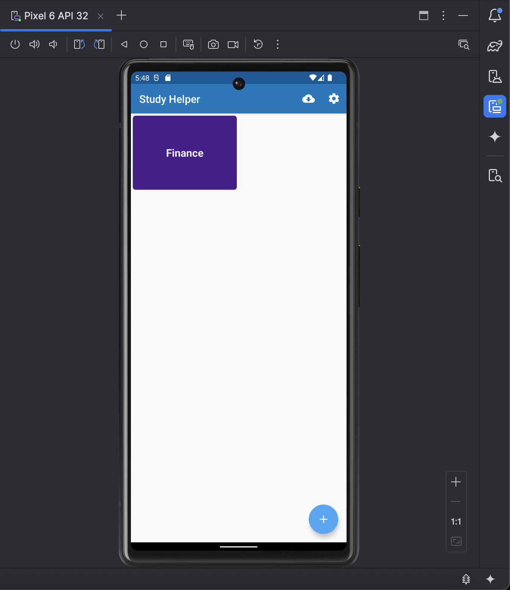
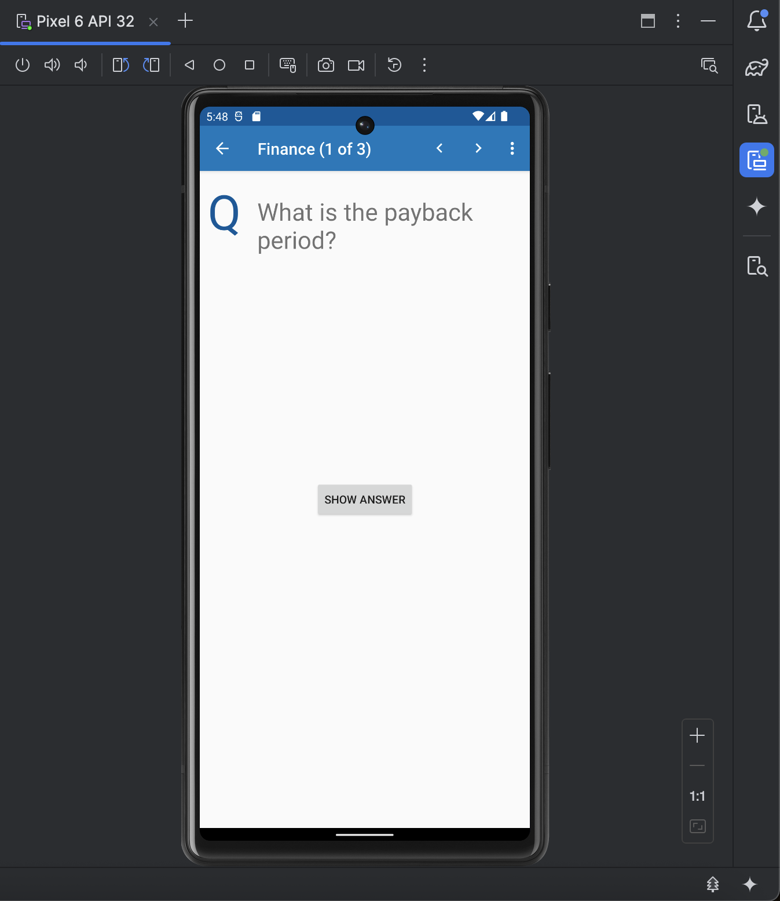
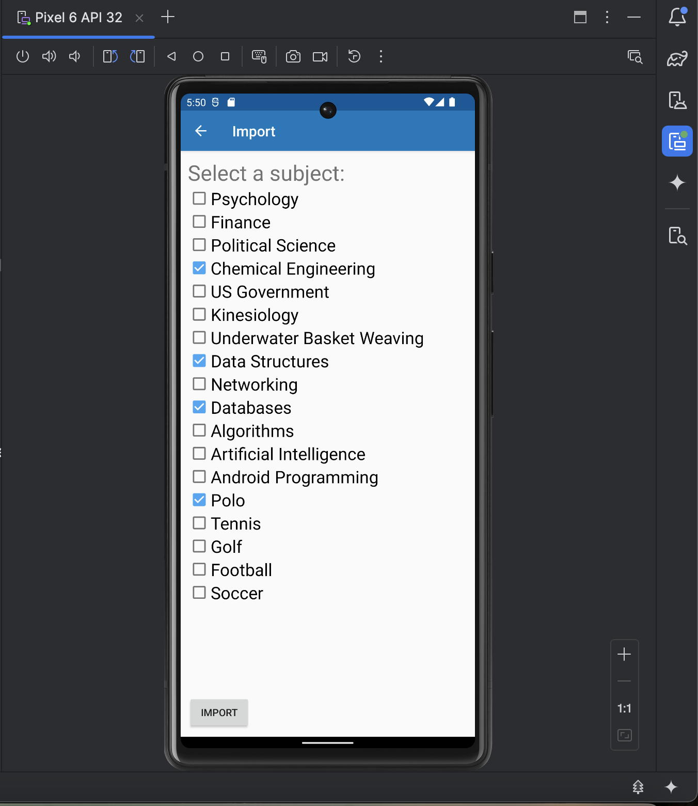
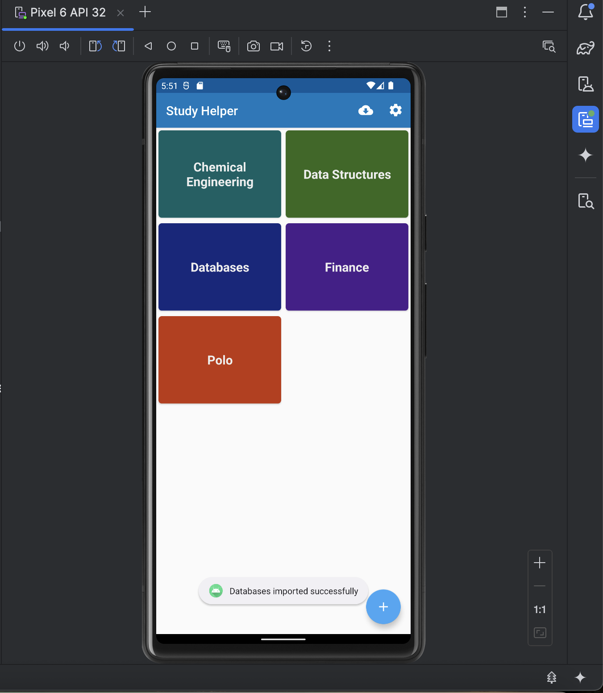
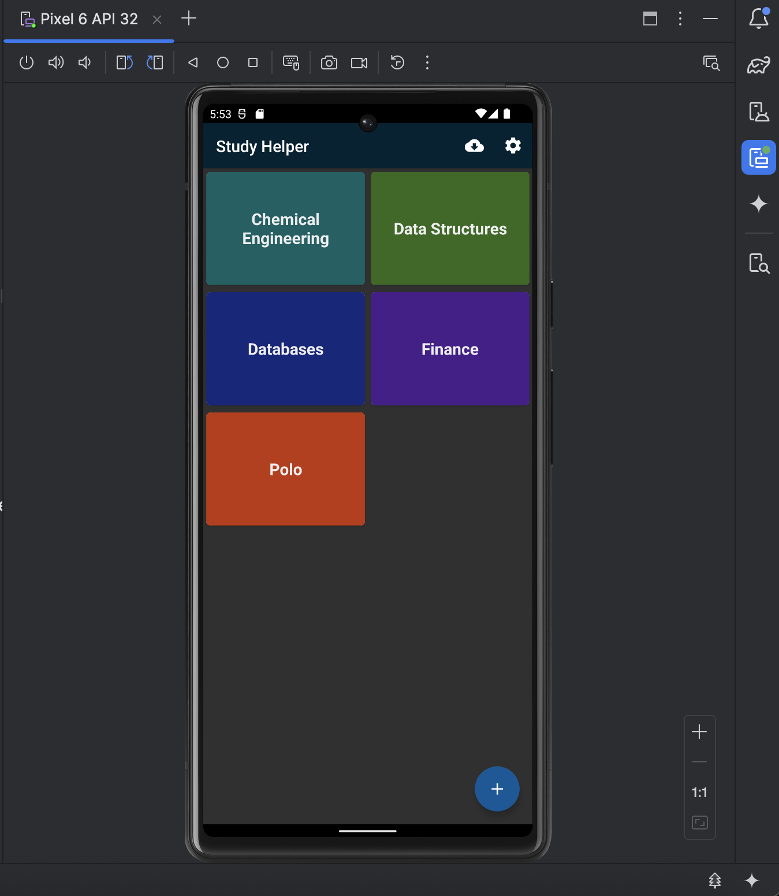
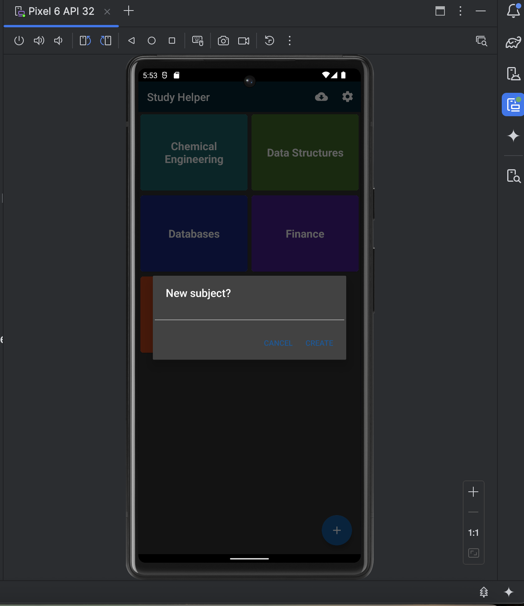

# 📘 Study Helper — Android Flashcard App

Study Helper is an Android app that helps organize study subjects and review questions in a clean, flashcard-style interface. Each subject contains a set of questions, and each question has a prompt and an answer that the user can reveal when ready.

This app uses the **Room persistence library**, **ViewModel + LiveData**, and a **Repository** layer to manage local data, plus a simple import feature to add new subjects from a remote source.

---

## ✨ Features

- 🏠 **Main Screen** with a grid of subject cards
- ❓ **Flashcard-style questions**: show/hide answer for each question
- 🔀 **Question navigation** using left/right arrows in the app bar
- ☁️ **Import subjects** from a remote source using checkboxes and an Import button
- ⚙️ **Settings screen** with:
  - Dark theme toggle  
  - Subject order (alphabetic / newest first / oldest first)  
  - Default question setting  
- ➕ **Add subject dialog** opened from the floating action button
- 🌙 **Dark mode** that updates the whole app theme

---

## 🖼️ Screenshots

### 1. Main Screen


### 2. Subject Question Page (Finance)


### 3. Showing the Answer


### 4. Next Question (Right Arrow)


### 5. Import Screen (Selecting Subjects and Importing)


### 6. Main Screen After Importing New Subjects


### 7. Settings Screen


### 8. Main Screen in Dark Mode


### 9. Add Subject Dialog


---

## 🧠 How It Works

### 📦 Data Layer (Room + Repository)

- **Entities**
  - `Subject` — represents a study subject/topic (id, text, updateTime).
  - `Question` — represents a single study question (id, question text, answer, subjectId as a foreign key).

- **DAOs**
  - `SubjectDao` — CRUD operations for subjects, returns `LiveData` so the UI updates automatically.
  - `QuestionDao` — CRUD and query operations for questions, also using `LiveData`.

- **Database**
  - `StudyDatabase` — Room database that ties together the entities and DAOs.

- **Repository**
  - `StudyRepository` — central data manager that:
    - Talks to `SubjectDao` and `QuestionDao`
    - Uses `StudyFetcher` to get data from a remote web API (via Volley)
    - Exposes convenient methods for ViewModels (local + remote data)

- **Network**
  - `StudyFetcher` — handles requests to a remote API to download subjects and questions in JSON form, then converts them into Kotlin objects.

---

### 🧭 ViewModel Layer

The app uses ViewModels to provide data to the UI in a lifecycle-aware way:

- `SubjectListViewModel` — manages the list of all subjects for the main screen.
- `QuestionListViewModel` — manages the list of questions for a given subject.
- `QuestionDetailViewModel` — handles a single question for viewing/editing.
- `ImportViewModel` — manages the list of importable subjects and saving imported data.

Each ViewModel talks to `StudyRepository` instead of directly accessing the database or network.

---

### 🖥 UI Layer

- **SubjectActivity**  
  Main screen showing subject cards, import icon, settings icon, and the add-subject button.

- **QuestionActivity**  
  Displays one question at a time for a chosen subject with:
  - Question text
  - Show/Hide Answer button
  - Left/right arrows to switch questions
  - Menu for adding, editing, or deleting questions

- **QuestionEditActivity**  
  Screen used to create or edit a question (question + answer fields).

- **ImportActivity**  
  Shows a list of available subjects with checkboxes. After selecting and pressing *Import*, chosen subjects and their questions are added locally.

- **SettingsActivity**  
  Handles user preferences:
  - Dark theme toggle
  - Subject sorting order
  - Default question setting

- **SubjectDialogFragment**  
  A dialog used to add a new subject by entering its name.

---

## 📁 Project Structure

```text
StudyHelper/
 ├── app/src/main/java/edu/lukina/studyhelper/
 │   ├── model/
 │   │   ├── Subject.kt
 │   │   └── Question.kt
 │   ├── repo/
 │   │   ├── SubjectDao.kt
 │   │   ├── QuestionDao.kt
 │   │   ├── StudyDatabase.kt
 │   │   ├── StudyFetcher.kt
 │   │   └── StudyRepository.kt
 │   ├── viewmodel/
 │   │   ├── SubjectListViewModel.kt
 │   │   ├── QuestionListViewModel.kt
 │   │   ├── QuestionDetailViewModel.kt
 │   │   └── ImportViewModel.kt
 │   ├── ui/
 │   │   ├── SubjectActivity.kt
 │   │   ├── QuestionActivity.kt
 │   │   ├── QuestionEditActivity.kt
 │   │   ├── ImportActivity.kt
 │   │   ├── SettingsActivity.kt
 │   │   └── SubjectDialogFragment.kt
 │   └── ...
 ├── app/src/main/res/layout/
 ├── app/src/main/res/menu/
 ├── app/src/main/res/values/
 ├── screenshots/
 │   ├── 1.png
 │   ├── 2.png
 │   ├── 3.png
 │   ├── 4.png
 │   ├── 5.png
 │   ├── 6.png
 │   ├── 7.png
 │   ├── 8.png
 │   └── 9.png
 └── README.md
